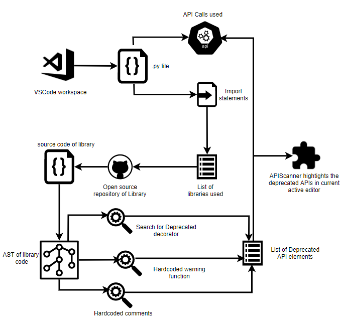
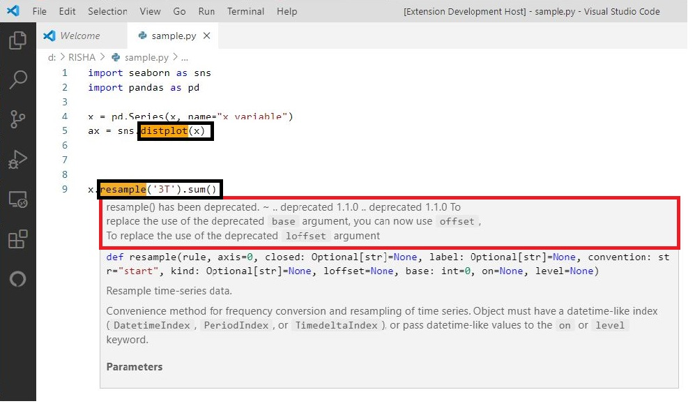

# APIScanner

# What is API*Scanner*
1. API*Scanner* is Visual Studio Code extension, that highlights the deprecated API elements used in python language.
2. The current version only detects deprecated APIs present in six python frameworks - *Scikit-learn*, *Numpy*, *Matplotlib*, *Pandas*, *Scipy*, *Seaborn*.

# Features of API*Scanner*
1. Identifies the deprecated API elements present in the current active editor.
2. On hover, hovercard pop-up shows the information regarding the deprecation (such as version in which it has been deprecated and any available replacement message provided by the library developer).

# Uses of API*Scanner*
1. Deprecated APIs are discouraged from being used in further software developments.
2. To help developers mitigate the usage of deprecated APIs during new software developments, the developer must be aware of the usage of deprecated APIs in the project.
3. Manually detecting and replacing deprecated APIs is a tedious and time-consuming task due to the large number of API calls used in the projects.
4. With the help of API*Scanner* developers can identify the deprecated APIs in the developing phase.

# Working of API*Scanner*
The approach followed by API*Scanner* is summarized below:

1. In the current active editor, it extracts the import statements to identify the libraries being used in the current program.
2. We then parse the soure code of library to generate Abstract Syntax Tree. 
3.  Structure of AST helps to realize the relationship between class declaration and function definition with decorator, hard-coded warnings, and comments
4. We then extract all the deprecated API elements declared using the above three methods.
5. We, now highlight all the deprecated API elements in the VS Code Editor, by matching with list of deprecated API elements we generated.

# Snapshot of UI

Snapshot of UI of API*Scanner* extension. The black boxes indicate deprecated APIs highlighted by API*Scanner*. The red box indicates the message shown by API*Scanner* on hovering over the highlighted deprecated APIs.

# What's inside API*Scanner*-Dev Repository:
package.json file triggers the extension, whenever the programming language used is python. out/commands/pyScripts contains the python scripts that generates the list of deprecated API elements. extension.ts file uses these list of deprecated API elements to highlight the usage of deprecated elements in the current active editor.

# Steps to install API*Scanner*
In visual studio code, click (ctrl+shift+x) to open Extensions tab. Now search for APIScanner and install it.

You can also navigate to https://marketplace.visualstudio.com/ and search for APIScanner and download the vsix package locally and install it in vscode.

# Steps to use API*Scanner*
1. In visual studio code, open an existing python file or create a new python.
2. You will be able to see usage of deprecated elements. 
# How to contribute to API*Scanner*
Incase of a bug or an enhancement idea or a feature improvement idea, please open an issue or a pull request. Incase of any queries or if you would like to give any suggestions, please feel free to contact Aparna Vadlamani (cs17b005@iittp.ac.in) or Rishitha Kalicheti (cs17b014@iittp.ac.in) or Sridhar Chimalakonda (ch@iittp.ac.in) of RISHA Lab, IIT Tirupati, India.