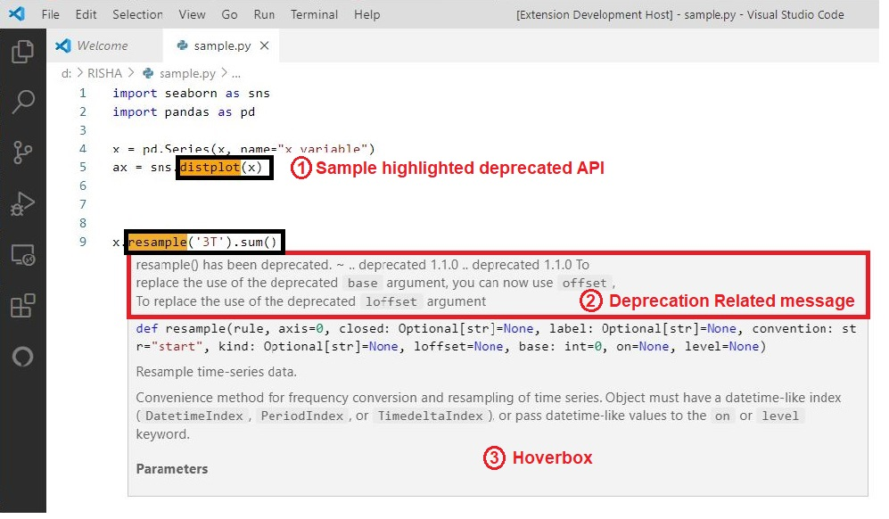

<<<<<<< HEAD
# APIScanner README
=======
# API*Scanner*
This Visual Studio Code Extension, **API*Scanner***, detects the deprecated APIs used in the developer's editor. API*Scanner* leverages the source code of the libraries used in the project to obtain a list of deprecated APIs. 
>>>>>>> 5e38389... fixed class object deprecation functionality

## Features

Approach we followed to highlight deprecated APIs are shown in the figure below:

Snapshot of results of API*Scanner* extension. The black boxes indicate deprecated APIs highlighted by API*Scanner*. The red box indicates the message shown by API*Scanner* on hovering over the highlighted deprecated APIs.

## Requirements

It is a python specific extension. 

## Issues

Calling out known issues can help limit users opening duplicate issues against your extension. You can post your issues at (https://github.com/rishitha957/APIScanner-dev/issues)

### 1.0.0

Initial release of API*Scanner*

-----------------------------------------------------------------------------------------------------------

### For more information

* [Source code of API*Scanner*](https://github.com/rishitha957/APIScanner-dev)
